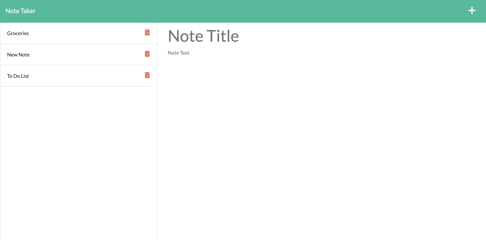

# Note Taker

## Table of Contents
- [Description](#description)
- [Installation](#installation)
- [Usage](#usage)
- [License](#license)
- [Contribution](#contribution)

## Description
create an application called Note Taker that can be used to write and save notes.

## Installation
npm i

## Usage
To be used to take notes. Technologies used are node, js, css, and express.

## License
MIT

## Contribution
Myself

## Questions?
If you have questions regarding this README, please reach out to me via GitHub or by email.
"https://github.com/Scottietee"
Email: sscotthompson@gmail.com

https://mighty-gorge-13486.herokuapp.com/

